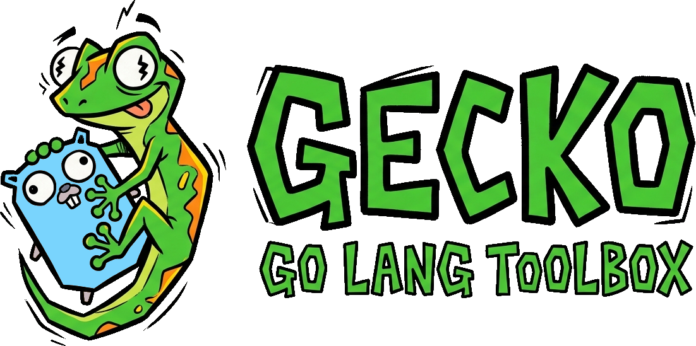

# Gecko

<p align="center">
  <picture>
    <source media="(prefers-color-scheme: dark)" srcset="assets/gecko-logo-dark.png">
    
  </picture>
</p>

<p align="center">
  <strong>A fast, cross-platform developer toolbox written in Go.</strong>
</p>

Gecko is a single CLI for useful development, filesystem, system, networking, and project utilities — with an extensible executable plugin system for adding commands without modifying the core application.

```text
gecko <command> [arguments] [flags]
```

> Gecko is both a useful developer tool and a serious Go engineering project built to explore production-quality software design.

---

## Why Gecko?

Developers constantly switch between small utilities:

```text
find
curl
python -m http.server
ps
lsof
dig
ping
sha256sum
tree
```

Gecko brings many common development tasks behind one consistent CLI:

```text
gecko doctor
gecko tree
gecko find
gecko hash
gecko serve
gecko watch
gecko project
gecko http
gecko dns
gecko run
```

But the goal isn't simply to recreate existing Unix tools.

Gecko is designed around a larger idea:

**one small, fast, cross-platform toolbox that can be extended through plugins.**

---

## Features

### System

Inspect and diagnose the local development environment.

```bash
gecko doctor
gecko info
gecko env
gecko ports
gecko processes
```

Example:

```text
$ gecko doctor

Gecko Doctor

System
  OS:       macOS
  Arch:     arm64
  Shell:    zsh

Development
  Go:       ✓ 1.27
  Git:      ✓ 2.51
  Docker:   ✓ 29.0
  Node:     ✓ 24.6

Issues: 0
```

---

### Filesystem

Useful filesystem operations without sacrificing safety.

```bash
gecko tree .
gecko find "*.go"
gecko clean
gecko hash ./file.iso
```

The filesystem commands are designed to handle large directory trees, large files, hidden files, filtering, errors, and platform differences.

For example:

```bash
gecko tree . --depth 3
gecko find --name "*.json"
gecko find --type file
gecko find --size ">10MB"
```

`gecko clean` is intentionally conservative. Destructive operations require explicit confirmation and are designed to avoid dangerous assumptions about what can safely be deleted.

---

### Development Server

A convenient static HTTP server:

```bash
gecko serve
```

or:

```bash
gecko serve ./dist --port 8080
```

Optional functionality can include:

```text
--host
--port
--open
--directory
--cors
--gzip
--spa
--watch
```

Example:

```text
Gecko Server

Directory: ./dist
Address:   http://localhost:8080

GET /index.html
GET /style.css
GET /app.js

Press Ctrl+C to stop
```

---

### File Watching

Run commands whenever files change:

```bash
gecko watch -- go test ./...
```

or:

```bash
gecko watch -- go run .
```

The watcher is designed to handle:

* File events
* Debouncing
* Ignore patterns
* Multiple directories
* Process restarting
* stdout/stderr forwarding
* Exit codes
* Cancellation
* Graceful shutdown

---

### Task Runner

Define development workflows in configuration:

```yaml
tasks:
  test:
    command: go test ./...

  build:
    command: go build ./...

  dev:
    command: go run .

  release:
    depends_on:
      - test
      - build
```

Then run:

```bash
gecko run test
gecko run build
gecko run dev
gecko run release
```

Independent tasks can eventually execute concurrently while respecting dependencies and cancellation.

---

### Project Analysis

Gecko can inspect a project and identify its characteristics:

```bash
gecko project info
gecko project tree
gecko project stats
gecko project deps
gecko project size
```

Example:

```text
Project
───────

Name:       myapp
Language:   Go
Go version: 1.27

Files:      143
Lines:      18,391
Tests:      47

Git:
  Branch:   main
  Changes:  3
```

Project detection can recognize ecosystems such as:

```text
Go          go.mod
Node        package.json
Rust        Cargo.toml
Python      pyproject.toml
Make        Makefile
Docker      Dockerfile
```

---

### HTTP Client

A lightweight terminal HTTP client:

```bash
gecko http GET https://example.com
```

JSON responses:

```bash
gecko http GET https://example.com/api/users --json
```

POST requests:

```bash
gecko http POST https://example.com/users \
  --data '{"name":"Alice"}'
```

Potential functionality includes:

* Headers
* Request bodies
* JSON
* Authentication
* Response formatting
* Status codes
* Timing information
* Response saving
* TLS information

---

### Networking

Network-oriented utilities include:

```bash
gecko dns example.com
gecko ping example.com
```

The implementations account for platform-specific networking behavior where necessary.

---

### Data Utilities

Gecko can also provide small data-processing tools:

```bash
gecko json file.json
gecko yaml file.yaml
gecko csv file.csv
gecko decode ...
```

These commands provide opportunities to work with parsing, streaming, formatting, and structured data.

---

### Fun

Not everything has to be serious.

```bash
gecko fun matrix
gecko fun ascii "TINKER"
gecko fun qr "https://example.com"
gecko fun color "#ff00aa"
gecko fun fortune
gecko fun timer 25m
```

Experimental terminal features can explore:

* ANSI escape sequences
* Terminal rendering
* Keyboard input
* Unicode
* Timers
* Animation
* Progress indicators
* TUIs

Fun commands remain optional and should never compromise Gecko's core usefulness.

---

# Plugin System

One of Gecko's defining features is its plugin architecture.

Plugins are primarily **standalone executables**, rather than shared libraries loaded directly into the Gecko process.

For example:

```text
gecko-docker
gecko-postgres
gecko-github
gecko-kubernetes
```

If `gecko-docker` is installed:

```bash
gecko docker ps
```

can delegate execution to:

```bash
gecko-docker ps
```

Gecko can discover installed plugins and expose them through its help system:

```text
Gecko

Core Commands

  doctor
  serve
  watch
  project
  clean

Plugins

  docker
  postgres
  github
```

---

## Plugin Metadata

Plugins expose metadata describing their capabilities.

For example:

```json
{
  "name": "docker",
  "version": "1.2.0",
  "description": "Docker utilities",
  "commands": [
    {
      "name": "ps",
      "description": "Show containers"
    },
    {
      "name": "cleanup",
      "description": "Remove unused resources"
    }
  ]
}
```

This allows Gecko to discover commands dynamically without embedding plugin-specific logic in the core binary.

The plugin protocol is designed around explicit process boundaries and well-defined communication.

Important concerns include:

* stdin/stdout/stderr
* JSON protocols
* Exit codes
* Version compatibility
* Timeouts
* Process failures
* Plugin crashes
* Security boundaries
* Capability discovery

---

# Plugin Manager

Eventually Gecko will support:

```bash
gecko plugin list
gecko plugin search docker
gecko plugin install docker
gecko plugin remove docker
gecko plugin update docker
gecko plugin update --all
```

Plugin installation will evolve incrementally:

```text
Local executable
      ↓
Local installation
      ↓
Remote binary installation
      ↓
Platform selection
      ↓
Checksums
      ↓
Version management
      ↓
Signature verification
      ↓
Plugin registry
```

The registry will **not** be built first.

The initial plugin system focuses on understanding discovery and process execution before introducing distribution infrastructure.

---

# Plugin SDK

Gecko will eventually provide a Go SDK for plugin developers.

Potential abstractions include:

```text
Command
Flag
Argument
Output
Logger
Config
Prompt
```

Developers should eventually be able to scaffold a plugin with:

```bash
gecko plugin create myplugin
```

producing a starting point for an independent Gecko plugin project.

---

# Cross-Platform

Gecko is designed for:

| OS      | Architecture |
| ------- | ------------ |
| Linux   | amd64        |
| Linux   | arm64        |
| macOS   | amd64        |
| macOS   | arm64        |
| Windows | amd64        |
| Windows | arm64        |

Cross-platform behavior is treated as a first-class engineering concern.

Platform-specific functionality may include:

* Process inspection
* Port discovery
* Signals
* Paths
* Configuration directories
* Browser launching
* Clipboard access
* Terminal behavior
* Environment handling

The project distinguishes between:

1. Platform-independent code
2. Interfaces hiding genuine platform differences
3. OS-specific implementations
4. Build-constrained source files

The goal is not to abstract everything.

The goal is to put abstractions exactly where they provide value.

---

# Configuration

Gecko uses platform-appropriate configuration locations rather than assuming a Unix filesystem layout.

Possible configuration:

```yaml
theme: auto

server:
  default_port: 8080

plugins:
  directory: ...
```

Configuration behavior is designed around the conventions of the host operating system.

---

# Design Philosophy

Gecko follows a few principles.

### Keep it simple

Do not create abstractions until there is a reason for them.

### Prefer the standard library

Third-party dependencies should solve real problems.

When a dependency is introduced, its alternatives and tradeoffs should be understood first.

### Make concurrency intentional

Go makes concurrency easy.

That doesn't mean every operation should be concurrent.

Concurrency should be introduced when it improves the design or performance of the actual workload.

### Errors are part of the API

Errors should provide useful information to users while retaining enough context for debugging.

Where appropriate, Gecko uses:

* Error wrapping
* Sentinel errors
* Typed errors
* Exit codes
* Structured diagnostics
* Debug logging

### Measure before optimizing

Performance work should be driven by evidence.

Gecko will eventually use:

```bash
go test -bench=.
```

and Go's profiling tools to investigate:

* CPU usage
* Memory usage
* Allocations
* Filesystem performance
* Subprocess overhead
* Concurrency overhead

### Security is not an afterthought

Particular attention is given to:

* Command execution
* Plugin execution
* File deletion
* Path traversal
* Temporary files
* Environment variables
* HTTP requests
* TLS
* Downloaded binaries
* Checksums
* Signature verification

---

# Testing

Testing is a core part of Gecko rather than a final step.

The project will use:

* Unit tests
* Table-driven tests
* Integration tests
* End-to-end CLI tests
* Temporary directories
* Test fixtures
* HTTP test servers
* Race detection
* Benchmarks
* Platform-specific tests

Typical commands include:

```bash
go test ./...
go test -race ./...
go test -cover ./...
go test -bench=.
```

Tests should cover failure conditions as seriously as successful execution:

```text
Invalid arguments
Missing files
Permission failures
Network failures
Timeouts
Process failures
Plugin crashes
Cancellation
Interrupted operations
Platform-specific behavior
```

---

# Development Philosophy

Gecko is developed incrementally.

The final architecture is **not designed upfront**.

Instead:

```text
Simple implementation
        ↓
Real requirements
        ↓
Increasing complexity
        ↓
Refactoring
        ↓
Clear package boundaries
        ↓
Stable architecture
```

This makes the repository itself a record of engineering decisions rather than an artificial architecture designed before the requirements exist.

---

# Learning Goals

Building Gecko is intended to develop advanced practical Go skills, including:

* Idiomatic Go
* Package design
* API design
* Interfaces
* Dependency direction
* Error handling
* Context cancellation
* Goroutines and channels
* Filesystem APIs
* Streaming I/O
* Process management
* `os/exec`
* HTTP servers and clients
* TCP and networking concepts
* Cross-platform development
* Build constraints
* CLI architecture
* Configuration
* Logging
* Testing
* Integration testing
* Benchmarking
* Profiling
* Performance analysis
* Security
* Plugin architecture
* Process communication
* Versioning
* Dependency management
* Cross-compilation
* CI/CD
* Release engineering
* Documentation

The objective is not to hide these concepts behind frameworks.

They should be encountered naturally while solving real engineering problems.

---

# Roadmap

## Level 1 — Foundation

* [ ] CLI structure
* [ ] Version command
* [ ] Help
* [ ] Configuration
* [ ] `tree`
* [ ] `hash`

## Level 2 — Developer Utilities

* [ ] `find`
* [ ] `clean`
* [ ] `project`
* [ ] `env`
* [ ] `doctor`

## Level 3 — Networking

* [ ] `serve`
* [ ] HTTP client
* [ ] DNS
* [ ] Ping

## Level 4 — Concurrency

* [ ] File watching
* [ ] Parallel filesystem operations
* [ ] Task execution

## Level 5 — Processes

* [ ] Process inspection
* [ ] Command execution
* [ ] Task dependencies
* [ ] Cancellation
* [ ] Signals

## Level 6 — Cross-Platform Engineering

* [ ] Linux implementations
* [ ] macOS implementations
* [ ] Windows implementations
* [ ] Platform-specific tests

## Level 7 — Terminal UX

* [ ] Colors
* [ ] Interactive prompts
* [ ] Progress indicators
* [ ] Fun commands
* [ ] TUI experiments

## Level 8 — Plugin System

* [ ] Plugin discovery
* [ ] Executable plugins
* [ ] Protocol
* [ ] Metadata
* [ ] Dynamic commands

## Level 9 — Plugin Ecosystem

* [ ] Plugin SDK
* [ ] Plugin scaffolding
* [ ] Local installation
* [ ] Remote installation
* [ ] Registry
* [ ] Version management
* [ ] Checksums
* [ ] Signature verification

## Level 10 — Production

* [ ] Comprehensive test suite
* [ ] Benchmarks
* [ ] Profiling
* [ ] Security review
* [ ] CI
* [ ] Cross-platform builds
* [ ] Release binaries
* [ ] Packaging
* [ ] Documentation

---

# Repository Evolution

The repository intentionally starts small.

Early on, it may look roughly like:

```text
gecko/
├── main.go
├── go.mod
└── ...
```

As requirements grow, responsibilities will be separated.

The eventual structure may resemble:

```text
gecko/
├── cmd/
├── internal/
│   ├── cli/
│   ├── config/
│   ├── filesystem/
│   ├── network/
│   ├── process/
│   ├── platform/
│   ├── plugin/
│   ├── project/
│   └── terminal/
├── sdk/
├── plugins/
├── testdata/
├── .github/
├── go.mod
├── go.sum
├── README.md
├── LICENSE
└── ...
```

This structure is a **destination, not a starting point**.

Packages will be extracted when the codebase demonstrates that the separation is justified.

---

# Development Workflow

Major changes should be represented by focused Git commits.

Examples:

```text
feat: add basic CLI structure
feat: implement directory tree command
feat: add cross-platform config paths
feat: add HTTP file server
test: add server integration tests
feat: add plugin discovery
```

Commit boundaries should represent meaningful changes in behavior or architecture rather than arbitrary chunks of implementation.

---

# CI/CD

Eventually Gecko will build and test across:

```text
Linux
macOS
Windows
```

and:

```text
amd64
arm64
```

CI will perform tasks such as:

```text
Formatting
Static analysis
Tests
Race detection where appropriate
Build verification
Cross-platform compilation
```

Release automation may eventually use a tool such as GoReleaser, but the underlying build and release process should be understood before relying on automation.

---

# Documentation

A production Gecko project should eventually include:

```text
README.md
CONTRIBUTING.md
SECURITY.md
CHANGELOG.md
```

as well as:

* Command reference
* Configuration documentation
* Architecture documentation
* Plugin development guide
* Plugin protocol documentation
* Release documentation

---

# Project Status

🚧 **Early development**

Gecko is being built incrementally as a serious Go engineering project.

The architecture, APIs, commands, and plugin protocol may change substantially during development.

The current priority is not maximizing the number of commands.

The priority is building a **small, well-designed foundation** that can grow without becoming difficult to understand or maintain.

---

# License

License to be determined.

---

## The Goal

Gecko should eventually be more than a collection of utilities.

It should be a compact example of how to take a Go application from:

```text
small CLI
   ↓
useful developer tool
   ↓
cross-platform application
   ↓
concurrent process-oriented system
   ↓
plugin platform
   ↓
distributable open-source project
```

while keeping the code understandable, tested, secure, and idiomatic throughout.

**Build the tool. Learn the engineering. Grow the architecture.**
